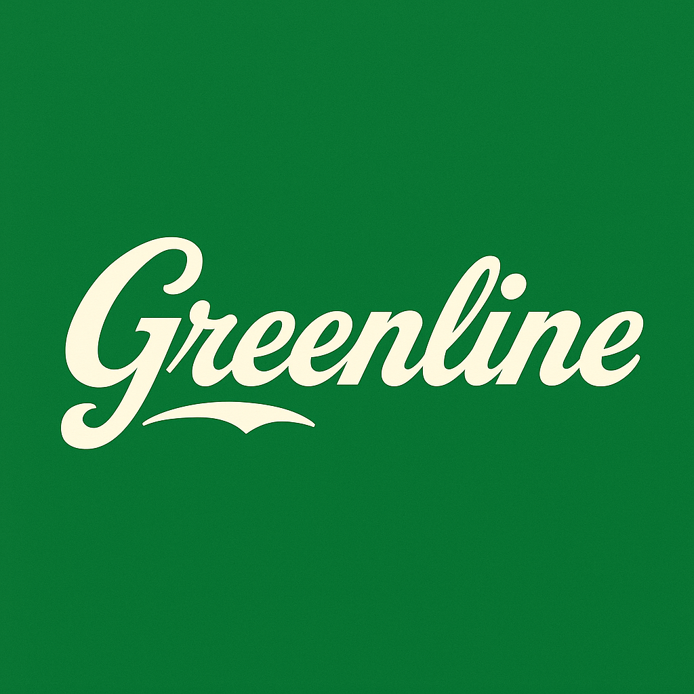

# Greenline — HR Sustainability & Lineage Demo

[](LICENSE)
[](#)
[](#)

**Greenline** is a portfolio-friendly demo app that showcases:
- Global **HR sustainability reporting** (SEC / EU CSRD / GRI / CbCR)
- **Data lineage** from source → platform → analytics
- **Headcount-weighted aggregation** across APAC, EMEA, LATAM, and North America
- **Trend analytics + Monte Carlo** forecasting
- A **sandbox** to model targets and probability of hitting compliance goals
- **Reporting calendar** (Gantt) and **export** to JSON/CSV
- **Dark / high-contrast mode** and branded UI

> This project is for demonstration/education. It does **not** contain proprietary assets and is not affiliated with any brand.

---

## ✨ Highlights

- **Compliance-ready framing**: SEC HCM, EU CSRD (ESRS S1/S2), GRI, CbCR
- **Assurance view**: track external auditor windows and PBC ownership
- **Scenario levers**: adjust training hours, safety intensity, remote eligibility
- **Safe exports**: JSON bundle + CSVs with date-safe serialization
- **Graphviz lineage**: readable in both dark and light modes

---

## 🧱 Tech Stack

- Python 3.10+
- Streamlit, Pandas, NumPy
- Altair (charts), Graphviz (lineage)
- Lightweight CSS theming

---

## 🚀 Quickstart

```bash
git clone https://github.com/Redskull23/greenline-demo.git
cd greenline-demo

python -m venv .venv
source .venv/bin/activate        # Windows: .\.venv\Scripts\activate

pip install -r requirements.txt
streamlit run app.py
